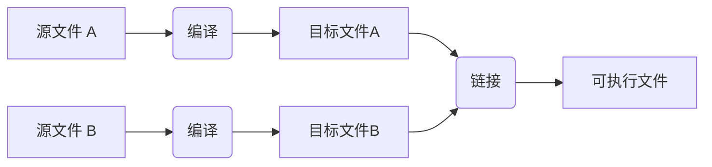

# 基础

+ 简介

+ 程序
  + Hello，World!

+ 
  函数

+ 类型、变量和算术运算
  + 算术；初始化

+ 作用域与生命周期

+ 常量

+ 指针、数组和引用
  + 空指针

+ 测试

+ 映射到硬件
  + 赋值；初始化

+ 建议


## 1.1 简介

本章非正式地介绍了C++的语法、C++内存和计算模型，以及将代码组织成程序的基本机制。这些是支持C语言中最常见风格的语法设施，有时被称为 **过程式编程** 。

## 1.2 程序

C++是一种编译型语言。为了让程序运行，其源代码必须经过编译器处理，产生目标文件，然后由链接器将这些目标文件组合成可执行程序。一个C++程序通常由许多源代码文件（通常简称为 **源文件** ）组成。



可执行程序是针对特定硬件/系统组合创建的；它不具备可移植性，比如说，从Android设备到Windows PC上无法直接运行。当我们谈论C++程序的可移植性时，通常是指源代码的可移植性；也就是说，源代码可以在多种系统上成功编译并运行。

ISO C++标准定义了两种实体：

 • **核心语言特性** ，例如内置类型（ **char** 和 **int** 等）和循环结构（如 **for** 语句和 **while** 语句）

 • **标准库组件** ，例如容器（ **vector** 和 **map** 等）和I/O操作（如 **<<** 和 **getline()** ）

标准库组件是由每个C++实现提供的完全普通的C++代码。也就是说，C++标准库本身可以用C++语言来实现，并且确实如此（除了极少数情况如 **线程** 上下文切换会使用到机器代码）。这意味着C++在表达力和效率上足以应对最苛刻的系统编程任务。

C++是一种静态类型的语言。这意味着对于每一个实体（例如，对象、值、名称和表达式），其类型必须在使用时为编译器所知。一个对象的类型决定了可以应用于它的操作集合及其在内存中的布局。

### 1.2.1  Hello, World!

一个最简单的C++程序如下所示：

```cpp
int main() { }
// 最简单的C++程序
```
这段代码定义了一个名为 **main** 的函数，该函数不接受任何参数并且不做任何事情。

在C++中，大括号 **{ }** 表示分组。在这里，它们标志着函数体的开始和结束。双斜杠 **//** 开始了一条注释，这条注释一直延续到行尾。注释是给人阅读的；编译器会忽略注释内容。

每个C++程序都必须精确地包含一个名为 **main()** 的全局函数。程序通过执行这个函数开始其运行。 **main()** 函数返回的 **int** 类型的值（如果有的话），就是程序给“系统”的返回值。如果没有返回任何值，系统将接收到一个表示成功完成的值。 **main()** 函数返回的非零值则表示程序执行失败。并非所有的操作系统和执行环境都会利用这个返回值：基于Linux/Unix的环境会用到，但基于Windows的环境很少使用这个返回值。

通常，一个程序会产生一些输出。下面是一个打印 " **Hello, World!** " 的程序：

```cpp
import std;
int main()
{
std::cout << "Hello, World!\n";
}
```

 **import std;** 这一行指令告诉编译器使标准库中的声明可用。如果没有这些声明，表达式

```cpp
std::cout << "Hello, World!\n";
```

将无法被正确解析。操作符 **<<** （“输出至”）将其第二个操作数的内容输出到第一个操作数指定的目标上。在这个例子中，字符串字面量 **"Hello, World!\n"** 被输出到标准输出流 **std::cout** 上。字符串字面量指的是由一对双引号包裹起来的字符序列。在字符串字面量内部，反斜杠 **\\** 后跟另一个字符组合在一起表示一个“转义字符”。这里， **\n** 是一个特殊的转义字符，代表换行。因此，实际输出的内容是 **“Hello, World!”** 后紧跟一个换行，使得下一次输出会出现在新的一行开始。

 **std::** 前缀表明名称 **cout** 是在标准库命名空间（§3.3）中定义的。在讨论标准库特性时，我通常会省略 **std::** 这部分；而在 §3.3 节中会展示如何不通过明确的限定符使命名空间中的名称变为可见。这意味着可以通过某些方式（比如使用 **using** 指令或者声明）直接使用命名空间中的名称，而不需要每次都写出 **std::** 前缀。这样可以使代码更加简洁，易于阅读。

 **import** 指令是C++20中新增的内容，它允许将整个标准库作为一个模块 **std** 来呈现，但目前还未成为正式标准。详细内容将在§3.2.2进行解释。如果在使用 **import std;** 时遇到问题，可以尝试使用传统和常规的方式来包含标准库。

```cpp
#include <iostream>// 包含输入输出流库的声明
int main()
{
std::cout << "Hello, World!\n";
}
```

这一点将在§3.2.1中进行详细解释，并且自1998年以来（参见§19.1.1），该方法已在所有C++实现上有效。几乎所有可执行代码都被放置在函数中，直接或间接地从 **main()** 函数调用。例如：

```cpp
import std;// 导入标准库的声明

using namespace std;// 使来自std的名字在没有std::的情况下可见

double square(double x) {// 计算一个双精度浮点数的平方
    return x * x;
}

void print_square(double x) {
    cout << "the square of " << x << " is " << square(x) << "\n";
}

int main() {
    print_square(1.234); // 输出：1.234的平方是1.52276
    return 0;
}
```

返回类型为 **void** 表示该函数不返回任何值。

## 1.3 函数

在C++程序中完成某项任务的主要方式是调用一个函数来执行它。定义函数就是指定操作如何完成的方式。除非已经声明了一个函数，否则无法调用它。

函数声明提供了函数的名称、返回值的类型（如果有的话），以及在调用时必须提供的参数的数量和类型。例如：

```cpp
Elem* next_elem();         // 无参数；返回指向Elem类型的指针（Elem*）
void exit(int);            // int类型的参数；不返回任何值
double sqrt(double);       // double类型的参数；返回一个double
```

在函数声明中，返回类型位于函数名之前，而参数类型则跟在函数名后面，并被圆括号包围。

参数传递的语义与初始化的语义相同（§3.4.1）。也就是说，会检查参数类型，并在必要时进行隐式参数类型转换（§1.4）。例如：

```cpp
double s2 = sqrt(2);  // 调用sqrt()，其参数为double类型的字面量2

double s3 = sqrt("three");  // 错误：sqrt() 需要一个double类型的参数
```

这种编译时检查和类型转换的价值不应被低估。 

函数声明中可以包含参数名称。这对程序的读者来说可能有帮助，但除非该声明同时也是一个函数定义，否则编译器会忽略这些名称。例如：

```cpp
double sqrt(double d); // 返回d的平方根
double square(double); // 返回参数的平方
```

函数的类型由其返回类型和紧随其后的参数类型序列（括在圆括号中）组成。例如：
```cpp
double get(const vector<double>& vec, int index);
// 类型: double(const vector<double>&, int)
```
函数可以是类的成员（§2.3，§5.2.1）。对于这样的 **成员函数** ，其类的名称也是函数类型的一部分。例如：
```cpp
char& String::operator[](int index);// 类型: char& String::(int)
```
我们希望我们的代码易于理解，因为这是可维护性的第一步。
实现可理解性的首要步骤是将计算任务分解为有意义的块（表示为函数和类）并命名这些块。这样，这些函数就提供了计算的基本词汇，就像类型（内置和用户定义的）为数据提供了基本词汇一样。

C++标准算法（例如， **find** 、 **sort** 和 **iota** ）提供了一个良好的开端（第13章）。接下来，我们可以将表示通用或特定任务的函数组合成更大的计算。

代码中的错误数量与代码量和代码复杂度强烈相关。这两个问题都可以通过使用更多且更短的函数来解决。使用函数执行特定任务通常可以避免我们在其他代码中间编写特定的代码段；将其设为函数迫使我们命名该活动并记录其依赖项。如果我们找不到合适的名称，那么很有可能存在设计问题。

如果使用相同的名称但具有不同参数类型定义了两个函数，编译器将为每个调用选择最合适的功能。例如：

```cpp
void print(int);  // 接受整数参数
void print(double);  // 接受浮点参数
void print(string);  // 接受字符串参数

void user() {
    print(42);  // 调用 print(int)
    print(9.65);  // 调用 print(double)
    print("Barcelona");  // 调用 print(string)
}
```
如果有两个可选函数都可以被调用，但彼此之间没有更优的选择，那么这个调用就被视为有歧义的，编译器会报错。例如：
```cpp
void print(int, double);
void print(double, int);

void user2() {
    print(0, 0);// 错误: 有歧义
}
```
定义多个同名函数称为 **函数重载** ，它是泛型编程（§8.2）的基本组成部分之一。当一个函数被重载时，具有相同名称的每个函数都应该实现相同的语义。 **print()** 函数就是这样一个例子；每个 **print()** 都打印其参数。

## 1.4 类型、变量和算术运算

每个名称和每个表达式都有一个类型，该类型决定了可以对其执行的操作。例如，声明

```cpp
int inch;
```
指定 **inch ** 是 **int** 类型的；即 **inch** 是一个整数变量。

 **声明** 是一种语句，它将一个实体引入程序并指定其类型：

• **类型** 定义了一组可能的值和一组操作（对于对象而言）。

• **对象** 是某些存储某种类型值的内存。

• **值** 是根据类型解释的一组比特。

• **变量** 是一个命名的对象。

C++提供了一个基本类型的小组，但因为我不是动物学家，所以我不会列出所有这些类型。你可以在参考资源中找到它们，比如网络上的[Cppreference]。一些例子包括：

```cpp
bool    // 布尔型，可能的值为true和false
char    // 字符，例如，'a'、'z'和'9'
int     // 整数，例如，-273、42和1066
double  // 双精度浮点数，例如，-273.15、3.14和6.626e-34
unsigned    // 非负整数，例如，0、1和999（用于位逻辑操作）
```

每个基本类型都直接对应于硬件设施，并且具有固定的大小，这决定了可以存储在其内的值的范围：


 **char** 类型的变量在给定机器上具有固定大小以容纳一个字符（通常为8位字节），而其他类型的大小是 **char** 大小的倍数。类型的大小是实现定义的（即，在不同的机器上可能会有所不同），可以通过 **sizeof** 运算符获得；例如， **sizeof(char)** 等于1，而 **sizeof(int)** 通常为 **4** 。当我们想要特定大小的类型时，可以使用标准库的类型别名，如 **int32_t** （§17.8）。

数字可以是浮点数或整数。

• 浮点数字面量通过小数点（如 **3.14** ）或指数（如 **314e-2** ）来识别。

• 整数字面量默认为十进制（例如， **42** 表示四十二）。前缀 **0b** 表示二进制（基数2）整数字面量（例如， **0b10101010** ）。前缀 **0x** 表示十六进制（基数16）整数字面量（例如， **0xBAD12CE3** ）。前缀 **0** 表示八进制（基数8）整数字面量（例如， **0334** ）。

为了使长字面量对人类阅读更加友好，我们可以使用单引号（'）作为数字分隔符。例如，π大约为 **3.14159'26535'89793'23846'26433'83279'50288** ，或者如果你偏好十六进制表示法，则为 **0x3.243F'6A88'85A3'08D3** 。

### 1.4.1 算术运算

```cpp
x+y          // 加法
+x           // 单目加
x-y          // 减法
-x           // 单目减
x*y          // 乘法
x/y          // 除法
x%y          // 整数的余数（模）
```

比较运算符同样适用：

```cpp
x==y         // 等于
x!=y         // 不等于
x<y          // 小于
x>y          // 大于
x<=y         // 小于或等于
x>=y         // 大于或等于
```

此外，还提供了逻辑运算符：

```cpp
x&y          // 按位与
x|y          // 按位或
!x           // 逻辑非（否定）
xˆy          // 按位异或
~x           // 按位取反
x&&y         // 逻辑与
x||y         // 逻辑或
```

按位逻辑运算符针对每个位上执行的操作产生相应操作数类型的结果。逻辑运算符 **&&** 和 **||** 根据其操作数的值简单地返回 **true** 或 **false** 。

在赋值和算术运算中，C++ 在基本类型之间执行所有有意义的转换，以便它们可以自由混合：

```cpp
void some_function() // 无返回值的函数
{
    double d = 2.2; // 初始化浮点数
    int i = 7;      // 初始化整数
    d = d+i;        // 将和赋值给 d
    i = d*i;        // 将积赋值给 i；注意：将双精度浮点数 d*i 舍入到整数
}
```

表达式中使用的转换称为 **常规算术转换** ，旨在确保以操作数的最高精度计算表达式。例如，双精度浮点数和整数的加法将使用双精度浮点运算来计算。

请注意， **=** 是赋值运算符，而 **==** 用于测试等同性。

除了常规的算术和逻辑运算符之外，C++ 还提供了更具体的操作来修改变量：

```cpp
x+=y	// x = x+y
++x		// increment: x = x+1
x-=y	// x = x-y
--x		// decrement: x = x-1
x∗=y	// scaling: x = x*y
x/=y	// scaling: x = x/y
x%=y	// x = x%y
```

这些运算符简明、便捷，并且使用非常频繁。
对于 **x.y** 、 **x->y** 、 **x(y)** 、 **x[y]** 、 **x<<y** 、 **x>>y** 、 **x&&y** 和 **x||y** ，计算顺序是从左到右。而对于赋值操作（如， **x+=y** ），计算顺序是从右到左。由于历史原因以及与优化相关的原因，不幸的是，其他表达式（例如， **f(x)+g(y)** ）和函数参数（例如， **h(f(x),g(y))** ）的计算顺序未指定。

### 1.4.2 初始化

在对象可以被使用之前，必须赋予其一个值。C++ 提供了多种表示初始化的符号，比如上面使用的 **=** ，以及一种基于花括号分隔初始化列表的通用形式：

```cpp
double d1 = 2.3;   // 将 d1 初始化为 2.3
double d2 {2.3};   // 将 d2 初始化为 2.3
double d3 = {2.3}; // 将 d3 初始化为 2.3（使用 { ... } 时 = 是可选的）
complex<double> z = 1; // 一个具有双精度浮点数标量的复数
complex<double> z2 {d1, d2};
complex<double> z3 = {d1, d2};// 使用 { ... } 时 = 是可选的
vector<int> v {1, 2, 3, 4, 5, 6}; // 一个 int 类型的向量
```
 **=** 形式是传统的，源自 C 语言，但如果有疑问，请使用通用的 **{}** 列表形式。至少，它 **能避免信息丢失的转换** ：

```cpp
int i1 = 7.8;// i1 变为 7（意外吗？）
int i2 {7.8};// 错误：浮点数到整数的转换
```
不幸的是，当使用 **=** （而非 **{}** ）时，允许并会隐式应用信息丢失的转换，即 **窄化转换** ，如 **double** 转换为 **int** 和 **int** 转换为 **char** 。隐式窄化转换引起的问题是为了保持与 C 兼容而付出的代价（§ 19.3）。

常量不能不初始化，变量也应仅在极其罕见的情况下才保持未初始化状态。在为一个名称赋值之前，请确保有一个合适的值。用户自定义类型（如 **string** 、 **vector** 、 **Matrix** 、 **Motor_controller** 和 **Orc_warrior** ）可以被定义为隐式初始化（§5.2.1）。

定义变量时，如果类型可以从初始化器推导出来，则不需要显式声明其类型：

```cpp
auto b = true;   // 一个布尔值
auto ch = 'x';   // 一个字符
auto i = 123;    // 一个整数
auto d = 1.2;    // 一个双精度浮点数
auto z = sqrt(y); // z 的类型由 sqrt(y) 返回的类型决定
auto bb {true};  // 一个布尔值
```

使用 **auto** 时，我们倾向于使用 **=** ，因为这不涉及可能引发问题的类型转换，但如果你更喜欢始终如一地使用 **{}** 初始化，也可以这样做。

在以下情况不推荐使用 **auto** ：

• 定义处于一个较大的作用域内，我们希望使代码阅读者能清晰地看到类型。

• 初始化器的类型不明显。

• 我们希望明确变量的范围或精度（例如，使用 **double** 而非 **float** ）。

通过使用 **auto** ，我们可以避免冗余和编写长类型名。在泛型编程中，这一点尤为重要，因为程序员可能难以确切知道对象的确切类型，而且类型名称可能相当长（§ 13.2）。

## 1.5 作用域与生命周期

声明会在某个作用域中引入其名称：

• **局部作用域** ：在函数或 Lambda 表达式中声明的名称称为 **局部名称** 。其作用域从声明点开始，一直延伸到包含该声明的块结束。 **块** 由一对大括号 **{ }** 来界定。函数参数的名称被视为局部名称。

• **类作用域** ：如果一个名称定义在类中，且不在任何函数）、Lambda 表达式（§ 7.3.2）或枚举类（§ 2.4）内部，那么该名称被称为 **成员名称** （或 **类成员名称** ）。其作用域从包围声明的开头 **{** 延伸到对应的 **}** 。

• **命名空间作用域** ：如果一个名称定义在命名空间（§ 3.3）中，且不在任何函数、Lambda 表达式、类或枚举类内部，那么该名称被称为 **命名空间成员名称** 。其作用域从声明点开始，一直延伸到其命名空间结束。

未在任何其他结构体内声明的名称称为 **全局名称** ，并被认为位于全局命名空间中。

此外，我们还可以拥有无名称的对象，如临时对象和使用 **new** 创建的对象（§ 5.2.2）。例如：

```cpp
vector<int> vec;  // vec 是全局的（一个整数的全局向量）
void fct(int arg)  // fct 是全局的（命名一个全局函数）arg 是局部的（命名一个整数参数）
{
    string motto {"Who dares wins"};  // motto 是局部的
    auto p = new Record{"Hume"};      // p 指向一个无名的 Record 对象（由 new 创建）
    // ...
}

struct Record {
    string name;  // name 是 Record 的成员（一个字符串成员）
};
```
对象必须在其使用前被构造（初始化），并且在其作用域结束时会被销毁。对于命名空间中的对象，销毁点是在程序结束时。对于成员对象，其销毁点由其所属对象的销毁点决定。通过 **new** 创建的对象将一直“存活”，直到被 **delete** 销毁（§ 5.2.2）。

## 1.6 常量

C++ 支持两种不可变性的概念（具有不可更改状态的对象）：

• **const** ：大致意为“我保证不改变这个值”。这主要用于指定接口，以便数据可以通过指针和引用传递给函数，而不必担心其被修改。编译器会强制执行由 **const** 所做的保证。 **const** 的值可能在运行时计算。

• **constexpr** ：大致意为“在编译时求值”。这主要用于指定常量，允许将数据放置在只读内存中（在那里不太可能被损坏），以及为了性能考虑。 **constexpr** 的值必须由编译器计算得出。

例如：
```cpp
constexpr int dmv = 17;// dmv 是一个命名常量
int var = 17;// var 不是一个常量
const double sqv = sqrt(var);// sqv 是一个命名常量，可能在运行时计算
double sum(const vector<double>&);// sum 不会修改其参数（§ 1.7）
vector<double> v {1.2, 3.4, 4.5};// v 不是一个常量
const double s1 = sum(v);// 正确：sum(v) 在运行时计算
constexpr double s2 = sum(v);// 错误：sum(v) 不是一个常量表达式
```
为了让函数能在编译时 **常量表达式** 中使用，也就是说，在由编译器计算的表达式中，该函数必须声明为 **constexpr** 或 **consteval** 。例如：
```cpp
constexpr double square(double x) { return x*x; }
constexpr double max1 = 1.4*square(17);// 正确：1.4*square(17) 是一个常量表达式
constexpr double max2 = 1.4*square(var);// 错误：var 不是一个常量，因此 square(var) 不是常量
const double max3 = 1.4*square(var);// 正确：可能在运行时计算
```
 **constexpr** 函数可以用于非常量参数，但这样做时结果不是常量表达式。我们允许在不需要常量表达式的上下文中，用非常量表达式参数调用 **constexpr** 函数。这样，我们不必实质上为同一个功能定义两次：一次用于常量表达式，一次用于变量。当我们希望一个函数 **仅用于编译时计算** 时，我们声明它为 **consteval** 而不是 **constexpr** 。例如：

```cpp
consteval double square2(double x) { return x * x; }
constexpr double max1 = 1.4 * square2(17);// 正确：1.4*square2(17) 是一个编译时常量表达式
const double max3 = 1.4 * square2(var);// 错误：var 不是一个常量
```
声明为 **constexpr** 或 **consteval** 的函数是 C++ 中 **纯函数** 概念的实现。它们不能有副作用，并且只能使用作为参数传递给它们的信息。特别是，它们不能修改非局部变量，但可以有循环并使用自己的局部变量。例如：
```cpp
constexpr double nth(double x, int n) // 假设 0<=n
{
    double res = 1;
    int i = 0;
    while (i < n) {       // while 循环：条件为真时执行（§ 1.7.1）
        res *= x;
        ++i;
    }
    return res;
}
```
在一些情况下，根据语言规则需要常量表达式（例如，数组边界（§ 1.7）、case 标签（§ 1.8）、模板值参数（§ 7.2）以及使用 **constexpr** 声明的常量）。在其他情况下，编译时计算对于性能至关重要。撇开性能问题不谈，不变性（一个具有不可更改状态的对象）的概念是设计中一个重要的考量因素。

## 1.7 指针、数组和引用

最基本的数据集合是连续分配的同一类型的元素的序列，称为 **数组** 。这基本上是硬件提供的内容。 **char** 类型元素的数组可以这样声明：
```cpp
char v[6];  // 6 个字符的数组
```
类似地，指针可以这样声明：
```cpp
char* p;  // 指向字符的指针
```
在声明中， **[ ]** 表示“‘array of”，*** ** 表示“pointer to”。所有数组的下界都是 ** 0 **，所以 ** v ** 有六个元素，从 ** v[0] ** 到 ** v[5]**。数组的大小必须是一个常量表达式（见§ 1.6）。

指针变量可以保存适当类型的对象的地址：
```cpp
char* p = &v[3];  // p 指向 v 的第四个元素
char x = *p;      // *p 是 p 指向的对象
```
在表达式中，前缀单目运算符 *** ** 表示“‘contents of”，而 ** &** 表示“address of”。我们可以这样图形化地表示：


考虑打印数组中的元素，可以使用以下代码实现：

```cpp
void print()
{
    int v[10] = {0, 1, 2, 3, 4, 5, 6, 7, 8, 9};
    for (auto i = 0; i != 10; ++i)    // 打印元素
        cout << v[i] << '\n';
   	//...
}
```

此 **for** 语句可读作：“将 **i** 设为零；只要 **i** 不是 **10** ，就打印第 **i** 个元素并增加 **i** 。”
C++ 还提供了一个更简单的 **for** 语句，称为范围 **for** 语句(range-for-statement)，用于以最简单的方式遍历序列：

```cpp
void print2()
{
    int v[] = {0, 1, 2, 3, 4, 5, 6, 7, 8, 9};
    for (auto x : v) // 遍历 v 中的每个 x
        cout << x << '\n';
}
for (auto x : {10, 21, 32, 43, 54, 65}) // 遍历列表中的每个整数
    cout << x << '\n';
// ...
```
第一个范围 **for** 语句可读作：“对于 **v** 中的每一个元素，从第一个到最后一个，将它的副本放入 **x** 并打印。” 注意，当我们用列表初始化数组时，不需要指定数组边界。范围 **for** 语句可以用于任何元素序列（§ 13.1）。

如果我们不想将 **v** 中的值复制到变量 **x** 中，而是让 **x** 直接引用一个元素，我们可以这样写：
```cpp
void increment()
{
    int v[] = {0, 1, 2, 3, 4, 5, 6, 7, 8, 9};
    for (auto& x : v)// 对 v 中的每个 x 加 1
        ++x;
    // ...
}
```
在声明中，单目后缀 **&** 表示“‘reference to”。引用类似于指针，不同之处在于访问引用所指的值时不需要使用前缀 *****。

另外， **引用在初始化后就不能再引用到不同的对象上了** 。

引用在指定函数参数时尤为有用。例如：
```cpp
void sort(vector<double>& v);// 对 v 进行排序（v 是一个双精度浮点数的向量）
```
通过使用引用，我们确保在调用 **sort(my_vec)** 时，不会复制 **my_vec** 。因此，真正被排序的是 **my_vec** 本身，而不是它的副本。

当我们不想修改参数，但仍想避免复制的成本时，我们会使用 **const** 引用（见§ 1.6），即对 **const** 的引用。例如：
```cpp
double sum(const vector<double>&)
```
接受 **const** 引用的函数非常常见。

在声明中使用的操作符（如 **&** 、*** ** 和 ** [] **）被称为** 声明符运算符**（declarator operators）：
```cpp
T a[n]    // T[n]: a 是 n 个 T 类型元素的数组
T* p      // T*: p 是指向 T 类型对象的指针
T& r      // T&: r 是对 T 类型对象的引用
T f(A)    // T(A): f 是一个函数，接受 A 类型的参数，返回 T 类型的结果
```
### 1.7.1 空指针

我们努力确保指针总是指向一个对象，以便对它进行解引用是合法的。当我们没有对象可以指向，或者需要表示“没有可用对象”的概念（例如，列表的结尾）时，我们会给指针赋予 **nullptr** （“空指针”）的值。所有指针类型共享唯一的 **nullptr** ：
```cpp
double* pd = nullptr;
Link<Record>* lst = nullptr;// 指向 Link<Record> 类型的指针
int x = nullptr;  // 错误：nullptr 是指针而不是整数
```
检查指针参数是否确实指向某个对象通常是明智的：
```cpp
int count_x(const char* p, char x)
// 统计 x 在 p[] 中出现的次数
// 假定 p 指向一个以零终止的 char 数组（或不指向任何对象）
{
    if (p == nullptr)
        return 0;
    int count = 0;
    for (; *p != 0; ++p)
        if (*p == x)
            ++count;
    return count;
}
```
我们可以通过使用 **++** 来使指针前进，指向数组的下一个元素，并且如果不需要的话，在 **for** 语句中可以省略初始化器。

 **count_x()** 的定义假设 **char** * 是 **C 风格字符串** ，即指针指向一个以零终止的 **char** 数组。字符串字面量中的字符是不可变的，因此为了处理 **count_x("Hello!")** ，我将 **count_x()** 的参数声明为 **const char** *。

在较旧的代码中，通常使用 **0** 或 **NULL** 代替 **nullptr** 。然而，使用 **nullptr** 可以消除整数（如 **0** 或 **NULL** ）和指针（如 **nullptr** ）之间可能产生的混淆。

在 **count_x()** 示例中，我们没有使用 **for** 语句的初始化部分，因此可以使用更简单的 **while** 语句：
```cpp
int count_x(const char* p, char x)
// 统计 x 在 p[] 中出现的次数
// 假定 p 指向一个以零终止的 char 数组（或不指向任何对象）
{
    if (p == nullptr)
        return 0;
    int count = 0;
    while (*p) {
        if (*p == x)
            ++count;
        ++p;
    }
    return count;
}
```
 **while** 语句会一直执行，直到其条件变为假。

对数值的测试（例如， **count_x()** 中的 **while (*p) **）等同于将值与 ** 0 ** 进行比较（例如，** while (*p != 0) **）。对指针值的测试（例如，** if (p) **）等同于将值与 ** nullptr ** 进行比较（例如，** if (p != nullptr)**）。

不存在“空引用”。引用必须指向一个有效的对象（并且实现假设确实如此）。存在一些晦涩且巧妙的方法可以违反这一规则；请不要尝试这样做。

## 1.8 测试

C++ 提供了一系列传统语句来表达选择和循环，比如 **if** 语句、 **switch** 语句、 **while** 循环和 **for** 循环。例如，下面是一个简单的函数，用于提示用户并根据响应返回布尔值：

```cpp
bool accept()
{
    cout << "Do you want to proceed (y or n)?\n"; // 输出问题
    char answer = 0; // 初始化为一个输入中不会出现的值
    cin >> answer; // 读取回答
    if (answer == 'y') 
        return true; 
    return false; 
}
```
与输出操作符 **<<** （“put to”）相对应， **>>** 操作符（“get from”）用于输入操作； **cin** 是标准输入流（第 11 章）。 **>>** 操作符右侧操作数的类型决定了接受什么样的输入，而其右侧操作数则是输入操作的目标。输出字符串末尾的 **\n** 字符代表一个换行符（§ 1.2.1）。

请注意， **answer** 的定义出现在需要它的地方（而不是在此之前）。声明可以出现在任何可以出现语句的地方。

该示例可以通过考虑对 **n** （表示“不”）的回答进行改进：

```cpp
bool accept2()
{
    cout << "你想要继续吗（y或n）？\n"; // 提问
    char answer = 0;// 初始化为一个不会在输入中出现的值
    cin >> answer; // 读取回答
    switch (answer) {
        case 'y':
            return true;
        case 'n':
            return false;
        default:
            cout << "我将视其为否定。\n";
            return false;
    }
}
```


 **switch** 语句将一个值与一组常量进行比较。这些常量被称为 **case** 标签，它们必须是互不相同的。如果被测试的值与它们中的任何一个都不匹配，则会选择 **default** 。如果该值与任何 **case** 标签都不匹配且没有提供 **default** ，那么将不会执行任何操作。

我们不必通过从包含其 **switch** 语句的函数返回来退出某个 **case** 。
通常，我们只想继续执行 **switch** 语句之后的语句。我们可以使用 **break** 语句来实现这一点。作为一个例子，考虑一个过于巧妙但又很原始的解析器，用于处理一个简单的命令式视频游戏：

```cpp
void action()
{
    while (true)
    {
        cout << "enter action:\n";// 请求行动
        string act;
        cin >> act; // 将字符读入字符串
        Point delta{0, 0};// Point 保存一个{x,y}对    
        for (char ch : act)
        {
            switch (ch)
            {
            case 'u': // 上
            case 'n': // 北
                ++delta.y;
                break;
            case 'r': // 右
            case 'e': // 东
                ++delta.x;
                    //...更多动作
                break;
            default:
                cout << "我冻结了！\n";
            }
            move(current + delta * scale);
            update_display();
        }
    }
}
```

类似于 **for** 语句（§ 1.7）， **if** 语句也可以引入一个变量并对其进行测试。例如：

```cpp
void do_something(vector<int>& v)
{
    if (auto n = v.size(); n != 0) {
        // ... 如果n!=0，我们就会到达这里 ...
    }
    // ...
}
```

在这里，整数 **n** 被定义并在if语句中使用，初始化为 **v.size()** ，并且在分号后的 **n!=0** 条件中立即进行测试。在if语句的条件中声明的名称在 **if** 语句的两个分支中都处于作用域内。

与 **for** 语句一样，在 **if** 语句的条件中声明一个名称的目的，是为了限制该变量的作用域，以此来提升代码的可读性并尽量减少错误。

最常见的情况是将变量与 **0** （或 **nullptr** ）进行比较。要这样做，只需省略明确提及的条件。例如：

```cpp
void do_something(vector<int>& v)
{
    if (auto n = v.size()) {
        // ... 如果n!=0，我们就会到达这里 ...
    }
    // ...
}
```

尽可能使用这种更简洁、更简单的形式。

## 1.9 映射到硬件

C++提供了与硬件直接对应的映射能力。当你使用基础操作时，其实现通常是硬件直接提供的，通常对应一条机器操作指令。例如，对两个 **int** 类型的变量 **x** 和 **y** 执行加法操作 **x+y** 时，会执行一条整数相加的机器指令。

C++的实现将机器的内存视为一系列内存位置，可以在这些位置放置（类型化的）对象，并通过指针来访问它们：


指针在内存中以机器地址的形式表示，因此图中 **p** 的数值值将是 **103** 。如果这看起来很像一个数组（§ 1.7），那是因为数组是C++对“内存中连续对象序列”的基本抽象。

基本语言构造到硬件的这种直接映射对于C和C++几十年来闻名的底层高性能至关重要。C和C++的基本机器模型基于计算机硬件，而不是某种数学形式。

### 1.9.1 赋值

内置类型的赋值是一个简单的机器复制操作。请考虑以下示例：

```cpp
int x = 2;
int y = 3;
x = y; // x 变为 3；因此我们有 x==y
```

这是显而易见的。我们可以这样图形化地表示这个过程：


 **这两个对象是独立的** 。我们改变 **y** 的值不会影响 **x** 的值。例如， **x=99** 不会改变 **y** 的值。与Java、C#等其他语言不同，但与C类似，这一规则适用于所有类型，不仅仅局限于 **int** 。

如果我们希望不同的对象引用同一个（共享的）值，我们必须明确指定。例如：

```cpp
int x = 2;
int y = 3;
int* p = &x;
int* q = &y;// 现在p!=q 且 *p!=*q
p = q;// p 变为 &y；现在 p==q，所以很明显 *p==*q
```

我们可以这样图形化表示这一过程：


这里我随意选择了 **88** 和 **92** 作为 **int** 的地址。同样，我们可以看到被赋值的对象会从赋值对象那里获得值，从而产生两个具有相同值的独立对象（此处为指针），也就是说， **p=q** 使得 **p==q** 。在 **p=q** 之后，两个指针都指向 **y** 。

引用和指针都引用/指向一个对象，并且在内存中都以机器地址的形式表示。然而，使用它们的语言规则有所不同。 **对引用的赋值并不会改变引用所指的对象** ，而是对被引用的对象进行赋值：

```cpp
int x = 2;
int y = 3;
int& r = x;// r 指向 x
int& r2 = y;// r2 指向 y
r = r2;// 通过 r2 读取，通过 r 写入：x 变为 3
```

我们可以这样图形化表示这一过程：


要访问指针所指向的值，你需要使用 *** **；而对于引用，这是隐式进行的。在执行 ** x=y ** 之后，对于每种内置类型以及设计良好的用户自定义类型（第2章），只要该类型提供了 ** = **（赋值运算符）和 ** == **（相等性比较运算符），我们都会有 ** x==y** 的结果。

### 1.9.2 初始化

初始化与赋值有所不同。一般来说，为了使赋值操作正常工作，被赋值的对象必须已经有一个确定的值。另一方面，初始化的任务则是将一块未初始化的内存变为一个有效的对象。对于几乎所有类型来说，从或向一个未初始化的变量读取/写入数据的行为都是未定义的。考虑引用的例子：

```cpp
int x = 7;
int& r {x}; // 将r绑定到x上（r引用x）
r = 7;      // 给r引用的对象赋值

int& r2;    // 错误：未初始化的引用
r2 = 99;    // 错误：试图给一个未初始化的引用赋值，这会导致未定义行为
```

幸运的是，我们不能拥有一个未初始化的引用；如果可以的话，那么 **r2=99** 这行代码将会把 **99** 赋值到某个不确定的内存位置上，最终导致不可预料的结果或程序崩溃。

你可以使用 **=** 来初始化一个引用，但请注意不要混淆这一点。例如：

```cpp
int& r = x; // 这仍然是初始化，它将r绑定到x上，而非任何形式的值拷贝
```

初始化与赋值之间的区别对于许多用户自定义类型也至关重要，比如 **string** 和 **vector** ，这些类型中的被赋值对象拥有需要最终释放的资源（§ 6.3）。

参数传递和函数返回值的基本语义也是基于初始化的（§ 3.4）。这就是我们如何实现引用传递的（§3.4.1）。

## 1.10 建议

这里的建议摘自《C++ Core Guidelines》[Stroustrup,2015]的一部分。指南的引用形式如 **[CG: ES.23]** ，意指“表达式与语句”章节中的第23条规则。通常，核心指南会提供更深入的理由和示例。

[1] 不要惊慌！一切都会随着时间变得清晰起来；§ 1.1；[CG: In.0]。

[2] 不要仅依赖内置特性。许多基本（内置）特性通常最好通过库间接使用，例如ISO C++标准库（第9至18章）；[CG: P.13]。

[3] 使用 **#include** （或更优地） **import** 必要的库以简化编程；§1.2.1。

[4] 编写优秀程序并不需要了解C++的每一个细节。

[5] 专注于编程技巧，而不是语言特性。

[6] ISO C++标准是关于语言定义问题的最终依据；§19.1.3；[CG: P.2]。

[7] 将有意义的操作“打包”为命名恰当的函数；§ 1.3；[CG: F.1]。

[8] 函数应该执行单一逻辑操作；§ 1.3；[CG: F.2]。

[9] 保持函数简短；§ 1.3；[CG: F.3]。

[10] 当函数对不同类型执行概念上相同任务时，使用重载；§ 1.3。

[11] 如果函数可能需要在编译时计算，则声明为 **constexpr** ；§ 1.6；[CG: F.4]。

[12] 如果函数必须在编译时计算，则声明为 **consteval** ；§ 1.6。

[13] 如果函数可能没有副作用，则声明为 **constexpr** 或 **consteval** ；§ 1.6；[CG: F.4]。

[14] 了解语言原语是如何映射到硬件上的；§ 1.4、1.7、1.9、2.3、5.2.2、5.4。

[15] 对于大数字字面量，使用数字分隔符以提高可读性；§ 1.4；[CG: NL.11]。

[16] 避免复杂的表达式；[CG: ES.40]。

[17] 避免窄化转换；§1.4.2；[CG: ES.46]。

[18] 最小化变量的作用域；§ 1.5、1.8。

[19] 保持作用域尽可能小；§ 1.5；[CG: ES.5]。

[20] 避免使用“魔法常数”；使用符号常量；§ 1.6；[CG: ES.45]。

[21] 倾向于使用不可变数据；§ 1.6；[CG: P.10]。

[22] 每个声明只声明一个名称；[CG: ES.10]。

[23] 保持常用和局部名称简短；保持不常用和非局部名称较长；[CG: ES.7]。

[24] 避免使用相似的名称；[CG: ES.8]。

[25] 避免使用 **全大写** 的名称；[CG: ES.9]。

[26] 在有命名类型的声明中，优先使用 **{}** 初始化器语法；§ 1.4；[CG: ES.23]。

[27] 使用 **auto** 避免重复类型名称；§1.4.2；[CG: ES.11]。

[28] 避免未初始化的变量；§ 1.4；[CG: ES.20]。

[29] 不要在有值对其初始化之前声明变量；§ 1.7、1.8；[CG: ES.21]。

[30] 在 **if** 语句的条件中声明变量时，倾向于使用隐式测试 **0** 或 **nullptr** 的版本；§ 1.8。

[31] 相比于显式循环变量的 **for** 循环，优先使用范围 **for** 循环；§ 1.7。

[32] 仅在位操作时使用 **unsigned** ；§ 1.4；[CG: ES.101] [CG: ES.106]。

[33] 保持指针的使用简单直接；§ 1.7；[CG: ES.42]。

[34] 使用 **nullptr** 而非 **0** 或 **NULL** ；§ 1.7；[CG: ES.47]。

[35] 不要在注释中说明可以通过代码清晰表达的内容；[CG: NL.1]。

[36] 在注释中说明意图；[CG: NL.2]。

[37] 保持一致的缩进风格；[CG: NL.4]。
